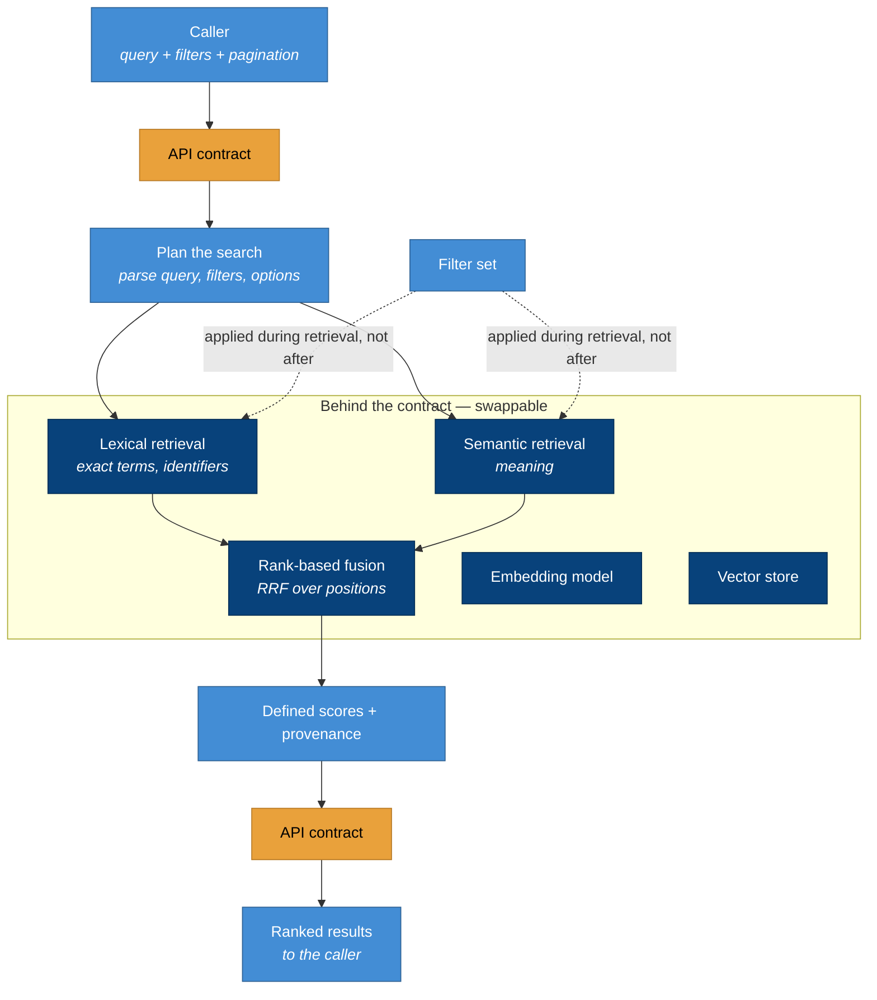
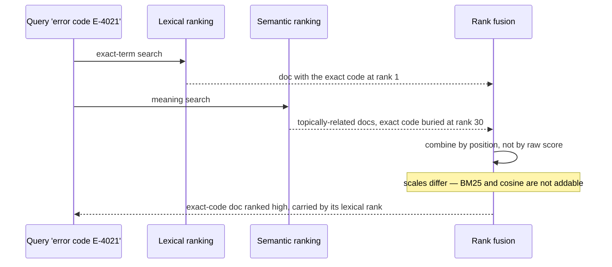

# The request path and hybrid fusion

Two diagrams: the request as it travels through the service behind the contract, and how the two
rankings fuse into one.

## The request path

A query enters through the stable contract and leaves as ranked results; everything in between — model,
store, ranking — is hidden ([ADR-0002](../adr/0002-search-is-a-service.md)). Filters are applied *with*
retrieval, not after ([ADR-0004](../adr/0004-filtering-in-the-query.md)).

The wall around the shaded box is the point: the caller touches only the contract, so the model, the
store, and the ranking can all change without a breaking change
([ADR-0002](../adr/0002-search-is-a-service.md)).

## Fusing the two rankings

Why hybrid beats either alone: each signal ranks its own strengths first, and rank-based fusion lets a
document carried by *either* signal surface ([ADR-0003](../adr/0003-hybrid-ranking.md)).

Had the service ranked purely on semantics, the document containing the exact code `E-4021` would have
sat at rank 30, beneath topically-similar-but-wrong results — the pure-semantic blind spot
([ranking.md](../ranking.md)). Rank fusion lets its strong lexical position carry it to the top, and a
meaning query like "why is my payment failing" is carried the other way, by its semantic rank. Fusing
by position rather than by raw score is what makes this robust, since BM25 and cosine scores are not on
a comparable scale ([ADR-0003](../adr/0003-hybrid-ranking.md)).
